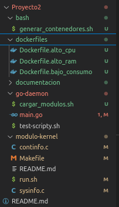
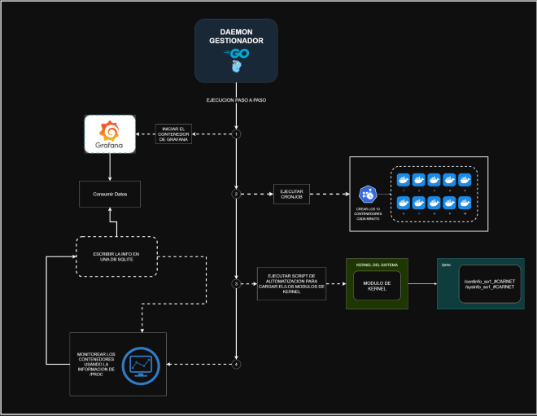
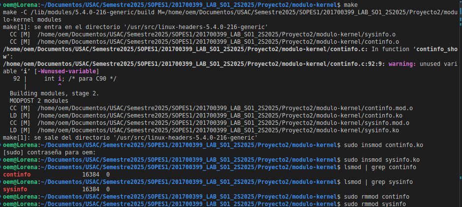
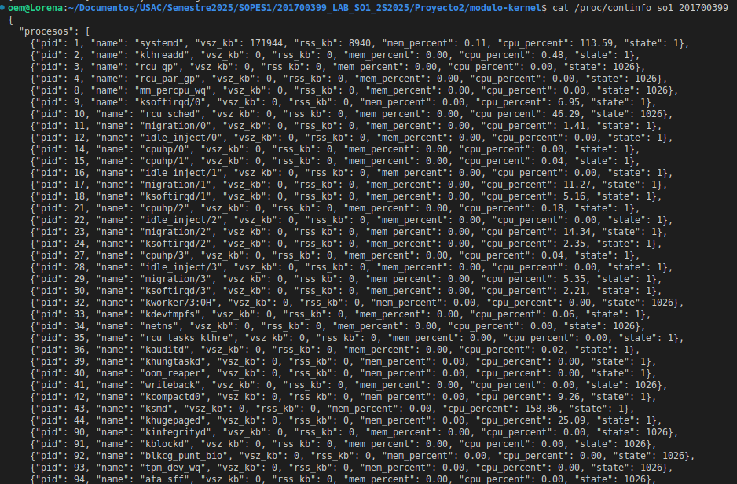
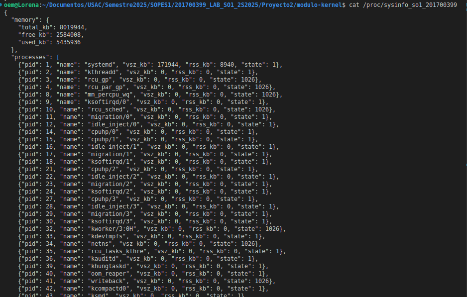
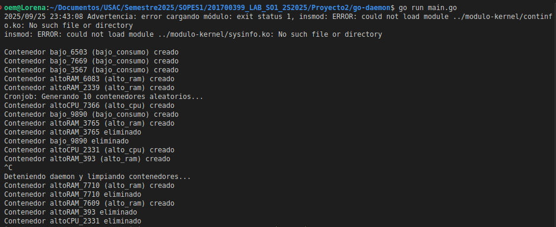

# Manual Técnico
# Estructura del Proyecto
<div style="text-align: center;">
  
</div>

# Arquitectura
<div style="text-align: center;">
  
</div>

## Estructura del Módulo

### Organización de archivos y directorios
- `/modulo-kernel/` : Contiene los módulos del kernel en C.
  - `continfo.c` : Módulo que captura métricas de contenedores.
  - `sysinfo.c` : Módulo que captura métricas generales del sistema.
  - `Makefile` : Para compilar los módulos.
  - Archivos `.ko` generados tras la compilación.
- `/go-daemon/` : Contiene el daemon en Go encargado de gestionar contenedores.
  - `main.go` : Código principal del daemon.
  - Otros archivos Go de soporte según la implementación.
- `/bash/` : Scripts bash utilizados para cargar módulos y generar contenedores.
  - `cargar_modulos.sh` : Script para cargar los módulos del kernel.
  - Scripts de automatización de contenedores.

### Funciones principales y su propósito
- **Módulos del kernel:**
  - `continfo.ko` : Expone métricas de contenedores en `/proc/continfo_so1_#CARNET`.
  - `sysinfo.ko` : Expone métricas del sistema en `/proc/sysinfo_so1_#CARNET`.
- **Daemon en Go:**
  - `cargarModuloKernel()` : Ejecuta script para cargar los módulos.
  - `cronjobGenerarContenedores()` : Genera contenedores de prueba cada minuto.
  - `gestionarContenedores()` : Mantiene el número mínimo de contenedores y elimina los extras.
  - `listarContenedoresProyecto()` : Lista contenedores gestionados por el proyecto.
  - `crearContenedor(nombre, imagen)` : Crea un contenedor Docker.
  - `eliminarContenedor(nombre)` : Elimina un contenedor Docker.
  - `limpiarContenedoresProyecto()` : Limpia todos los contenedores del proyecto.

### Dependencias externas
- Docker instalado y corriendo.
- Acceso a permisos de superusuario para cargar módulos (`sudo`).
- Go instalado para ejecutar el daemon.

## Compilación del Módulo
1. Abrir terminal y navegar a `/modulo-kernel/`.
2. Ejecutar:
   ```bash
   make
   ```

## Carga y Descarga del Módulo

### Carga
   ```bash
   sudo insmod continfo.ko
   sudo insmod sysinfo.ko
   ```
### Descarga

   ```bash
sudo rmmod continfo
sudo rmmod sysinfo
   ```

### Verificar carga

   ```bash
lsmod | grep continfo
lsmod | grep sysinfo
dmesg | tail
   ```

<div style="text-align: center;">
  
</div>

### Pruebas y Verificación

Leer archivos /proc:
   ```bash
cat /proc/continfo_so1_201700399
cat /proc/sysinfo_so1_201700399
   ```
<div style="text-align: center;">
  
</div>


<div style="text-align: center;">
  
</div>


# Decisiones de Diseño y Problemas

Se implementó un cronjob interno en Go para evitar dependencia de crontab del sistema.

Se agregaron delays (time.Sleep) para evitar saturar la máquina al crear contenedores.

Manejo de señales (Ctrl+C) para limpiar contenedores al finalizar el daemon.

Problema común: insmod fallaba si el módulo ya estaba cargado; solución: manejo de errores y mensajes claros.

# Estructura del Daemon GO
A continuación se documentan todas las funciones implementadas en el archivo `main.go`, explicando su propósito y funcionamiento.


<div style="text-align: center;">
  
</div>
---

### `func main()`
Es la función principal que inicializa el daemon.  
- Configura un **manejador de señales** (`Ctrl+C`) para limpiar los contenedores antes de salir.  
- Llama a `cargarModuloKernel()` para insertar los módulos del kernel.  
- Inicia el cronjob interno (`cronjobGenerarContenedores`) que crea contenedores cada cierto tiempo.  
- Ejecuta un **bucle infinito** que cada 40 segundos llama a `gestionarContenedores()` para mantener las restricciones de contenedores.

---

### `func cargarModuloKernel() error`
- Ejecuta el script `cargar_modulos.sh` que inserta los módulos del kernel (`continfo.ko` y `sysinfo.ko`).  
- Si ocurre un error, devuelve el mensaje correspondiente.  
- Si funciona correctamente, los archivos `/proc/continfo_so1_#CARNET` y `/proc/sysinfo_so1_#CARNET` quedan disponibles para ser leídos.

---

### `func cronjobGenerarContenedores()`
- Simula un **cronjob interno** en Go.  
- Cada 90 segundos, genera **10 contenedores aleatorios** de las imágenes `bajo_consumo`, `alto_cpu` o `alto_ram`.  
- Después de crear cada contenedor, espera 3 segundos para evitar saturar la máquina.

---

### `func crearContenedor(nombre, imagen string)`
- Crea un nuevo contenedor en **Docker** usando el comando:
  ```bash
  docker run -d --name <nombre> <imagen>
  ```

#### Dockerfile
``` bash 
docker build -t bajo_consumo -f Dockerfile.bajo_consumo .
docker build -t alto_cpu -f Dockerfile.alto_cpu .
docker build -t alto_ram -f Dockerfile.alto_ram .
```
