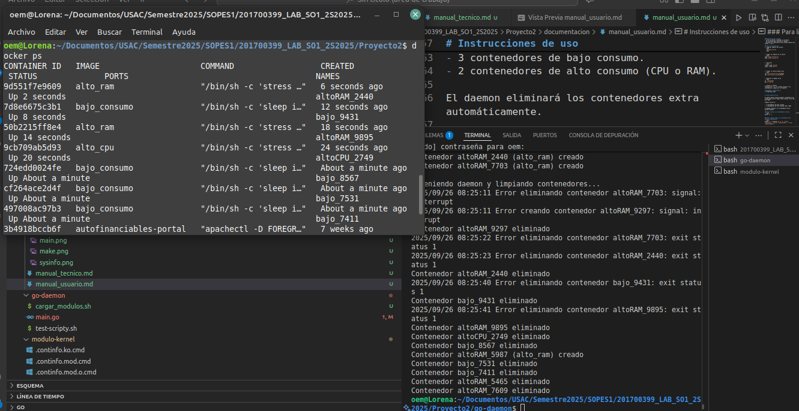

# Manual de Usuario

# Introducción

Este sistema permite monitorear y gestionar contenedores Docker en Linux mediante dos módulos de kernel escritos en C y un daemon desarrollado en Go.
Los módulos exponen información de procesos y memoria a través de /proc, mientras que el daemon se encarga de generar, mantener y eliminar contenedores automáticamente según reglas predefinidas.


## Instrucciones para el usuario final
Este proyecto permite gestionar contenedores Docker y monitorear métricas del sistema mediante un daemon en Go.

### Requisitos del sistema
- Linux con Docker instalado y corriendo.
- Go instalado para ejecutar el daemon.
- Permisos de superusuario para cargar módulos del kernel (`sudo`).

### Guía de instalación
1. Compilar módulos del kernel:
```bash
   cd modulo-kernel
   make
```

2. Cargar los módulos en el kernel
```bash
sudo insmod continfo.ko
sudo insmod sysinfo.ko
```


3. Verificar
```bash
lsmod | grep continfo
lsmod | grep sysinfo
```


4. Probar la lectura desde /proc
```bash
cat /proc/continfo_so1_201700399
cat /proc/sysinfo_so1_201700399
```

<div style="text-align: center;">
  
</div>

<div style="text-align: center;">
  
</div>


5. Ejecutar el daemon en Go
```bash
cd ../go-daemon
go run main.go
```

6. Detener el daemon
Presione Ctrl + C, el sistema eliminará los contenedores creados por el proyecto.

# Diagramas y Arquitectura


# Instrucciones de uso

El daemon genera automáticamente contenedores de prueba cada cierto tiempo (bajo consumo, alto CPU, alto RAM).

Siempre existirán:

- 3 contenedores de bajo consumo.
- 2 contenedores de alto consumo (CPU o RAM).

El daemon eliminará los contenedores extra automáticamente.

### Para revisar los contenedores activos:
```bash
docker ps -a
```

### Para limpiar todos los contenedores del proyecto manualmente:
```bash
docker rm -f $(docker ps -a -q --filter "name=bajo_" --filter "name=altoCPU_" --filter "name=altoRAM_")
```

<div style="text-align: center;">
  
</div>